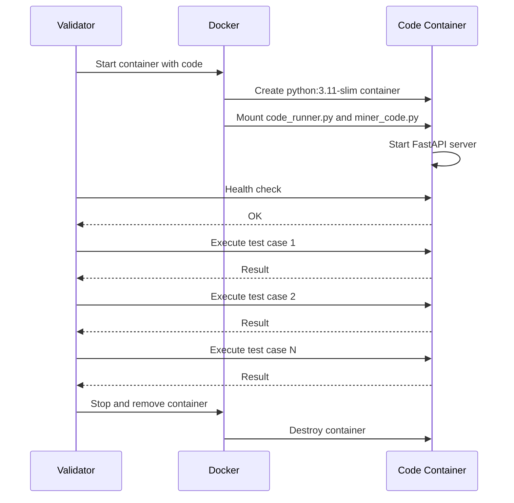

<div align="center">

# QUASAR: Long Context Foundation Models & Evaluation Subnet

[](https://github.com/your-org/QUASAR-TAO)
[](https://opensource.org/licenses/MIT)

---
## Shaping the Future of Long-Context Understanding

</div>

---

- [Introduction](#introduction)
- [Key Features](#key-features)
- [How It Works](#how-it-works)
  - [Miners](#miners)
  - [Validators](#validators)
- [Docker Architecture](#docker-architecture)
  - [Overview](#overview)
  - [Validator Docker Setup](#validator-docker-setup)
  - [Code Execution Containers](#code-execution-containers)
- [Evaluation Process](#evaluation-process)
  - [Benchmark Tasks](#benchmark-tasks)
  - [Scoring System](#scoring-system)
  - [Reward Calculation](#reward-calculation)
- [Supported Models](#supported-models)
- [Running Miners and Validators](#running-miners-and-validators)
  - [Running a Miner](#running-a-miner)
  - [Running a Validator](#running-a-validator)
- [Roadmap](#roadmap)
- [Contributing](#contributing)
- [License](#license)

---

## Introduction

Welcome to QUASAR, a Bittensor subnet dedicated to advancing long-context language models through comprehensive evaluation and incentivization. As AI systems tackle increasingly complex tasks requiring understanding of extensive documents, code repositories, and conversations, the ability to process ultra-long contexts (32k to 2M tokens) becomes critical.

QUASAR provides a decentralized evaluation framework where miners compete by running state-of-the-art long-context models, and validators assess their performance using real-world benchmarks. Our main product is the QUASAR foundation models—built specifically to process millions of tokens—which serve as the benchmark for evaluating all models on long-context capabilities. By harnessing the Bittensor network, we're building the most comprehensive long-context evaluation system in existence while extending model capabilities for handling increasingly large contexts.

## Key Features

- **Real-World Benchmarks**: LongBench tasks including NarrativeQA, Qasper, GovReport, and more
- **Context Scaling**: Evaluations from 32k to 2M tokens
- **Fair Rewards**: Accuracy-based scoring directly proportional to performance
- **Model Diversity**: Support for multiple architectures (Qwen, Kimi, Llama)
- **Transparent Metrics**: WandB integration for real-time performance tracking
- **Mock Mode**: Local testing with real model inference

## How It Works

### Miners

Miners run long-context language models and respond to benchmark evaluation requests from validators. Key responsibilities:

- Load and maintain a long-context capable model
- Process evaluation requests with context lengths up to 2M tokens
- Generate accurate responses to questions based on provided context
- Optimize for both accuracy and inference speed

Supported models include:
- silx-ai/Quasar-2M-Base (2M context specialist)
- moonshotai/Kimi-Linear-48B-A3B-Instruct (48B parameters)
- Qwen/Qwen3-Next-80B-A3B-Thinking (80B parameters with advanced reasoning)

### Validators

Validators evaluate miner performance using standardized benchmarks:

- Select random tasks from LongBench dataset
- Send context + question to miners
- Calculate accuracy using dataset-specific metrics (F1, EM, ROUGE)
- Apply context-length multipliers to reward harder tasks
- Update miner scores based on performance

## Docker Architecture

### Overview

QUASAR uses Docker containers for secure and isolated code execution. The architecture consists of two main container types:

1. Validator containers - Evaluate miner submissions using Docker for code execution
2. Code execution containers - Ephemeral containers that execute miner code in a sandboxed environment

The validator creates temporary Docker containers for each submission, executes test cases, then destroys the containers. This ensures security and isolation while allowing flexible code evaluation.

### Code Execution Containers

When evaluating miner submissions, the validator creates ephemeral Docker containers that execute the code in a sandboxed environment.

Container lifecycle:



Container details:

Image: python:3.11-slim

Mounted files:
- /app/miner_code.py - Miner's submitted code (read-only)
- /app/code_runner.py - Execution handler (read-only)

Startup command:
```bash
pip install fastapi uvicorn pydantic -q && \
python code_runner.py {port}
```

Health check:
```bash
GET http://localhost:{port}/health
Response: {"status": "healthy", "version": "1.0"}
```

Execution endpoint:
```bash
POST http://localhost:{port}/execute
Body: {
  "code": "def add(a, b):\n    return a + b",
  "function_name": "add",
  "test_input": "[1, 2]"
}
Response: {
  "success": true,
  "output": 3,
  "error": null,
  "execution_time_ms": 2.5
}
```

Security features:

- No network access
- No file system write access
- Code validation blocks dangerous imports (os, sys, subprocess, etc.)
- Container is destroyed after execution
- Execution timeout (30 seconds default)

Container reuse optimization:

Instead of creating a new container for each test case, the validator:
1. Starts one container per submission
2. Executes all test cases sequentially in the same container
3. Stops the container after all tests complete

This reduces overhead from ~30 seconds per test to ~5 seconds total for a submission with 3 test cases.

## Evaluation Process

### Benchmark Tasks

QUASAR uses tasks from the LongBench suite:

1. **Question Answering**
   - NarrativeQA: Story comprehension
   - Qasper: Scientific paper QA
   - MultiFieldQA: Multi-domain questions

2. **Summarization**
   - GovReport: Government document summaries
   - QMSum: Meeting summarization
   - MultiNews: Multi-document news summaries

3. **Classification**
   - TREC: Question classification
   - TriviaQA: Trivia questions

### Scoring System


### Reward Calculation

Rewards are calculated to be directly proportional to accuracy:

```python
# 1. Calculate raw accuracy (0.0 to 1.0)
accuracy = metric_fn(response, expected_answer)

# 2. Apply context-length multiplier
multipliers = {
    "32k": 1.0,    # Baseline
    "124k": 1.2,   # +20% bonus
    "512k": 1.5,   # +50% bonus
    "1.5m": 1.8,   # +80% bonus
    "2m": 2.0      # +100% bonus
}

# 3. Final reward (capped at 1.0)
reward = min(accuracy * multiplier, 1.0)
```

**Example**: A miner achieving 60% accuracy on a 2M token task receives:
- Raw accuracy: 0.60
- Multiplier: 2.0
- Final reward: min(0.60 × 2.0, 1.0) = 1.0

This incentivizes both accuracy and tackling longer contexts.

## Supported Models

Current supported models for miners:

| Model | Parameters | Context Length | Specialty |
|-------|-----------|----------------|-----------|
| silx-ai/Quasar-2M-Base | 26B | 2M tokens | Long context specialist |
| moonshotai/Kimi-Linear-48B-A3B-Instruct | 48B | 1M+ tokens | High performance |
| Qwen/Qwen3-Next-80B-A3B-Thinking | 80B | 128k tokens | Advanced reasoning |

## Running Miners and Validators

### Running a Miner

**Requirements**:
- Python 3.9+
- GPU with sufficient VRAM (varies by model)
- Bittensor wallet

**Setup**:
```bash
# Clone repository
# Clone repository
git clone https://github.com/SILX-LABS/QUASAR-SUBNET
cd QUASAR-SUBNET

# Install dependencies
pip install -r requirements.txt
pip install -e .

# Run miner
python neurons/miner.py \
  --wallet.name miner \
  --wallet.hotkey default \
  --subtensor.network finney \
  --netuid 439 \
  --axon.port 8091 \
  --miner.model_name "silx-ai/Quasar-2M-Base"
```

**Tips for Better Performance**:
1. Use models optimized for long contexts
2. Ensure sufficient GPU memory for your chosen model
3. Monitor your scores via WandB
4. Optimize inference speed without sacrificing accuracy

### Running a Validator

**What the validator does:**
- Polls the validator API for pending miner code submissions
- Creates Docker containers to execute miner code safely
- Evaluates code against test cases
- Updates scores in the API
- Other validators fetch weights from API and submit to Bittensor

**Requirements:**
- Python 3.11+
- Docker (for executing miner code in containers)
- Bittensor wallet with sufficient TAO for registration
- Internet connection (for API access)

**Setup:**

```bash
# Clone repository
git clone https://github.com/SILX-LABS/QUASAR-SUBNET
cd QUASAR-SUBNET

# Install Python dependencies
pip install -r requirements.txt
pip install -e .

# Start Docker (if not running)
# On Linux: sudo systemctl start docker
# On Mac/Windows: Docker Desktop should be running

# Run validator
python neurons/validator.py \
  --netuid 24 \
  --subtensor.network finney \
  --wallet.name validator \
  --wallet.hotkey default \
  --neuron.polling_interval 300
```

**No need to build Docker images:**
- The validator automatically pulls `python:3.11-slim` from Docker Hub
- The `challenge/code_runner.py` script is mounted into containers automatically
- You only need Docker installed, not any custom images

**What happens when you run:**
1. Validator polls API for pending submissions
2. For each submission, creates a Docker container
3. Executes test cases in the container
4. Calculates score and updates API
5. Waits 5 minutes before next check (configurable)

**Optional: Run validator in Docker (for production):**

```bash
# Build validator image
docker build -t quasar-validator -f docker/Dockerfile.validator .

# Run validator container
docker run -d \
  --name quasar-validator \
  -v ~/.bittensor/wallets:/root/.bittensor/wallets \
  -v /var/run/docker.sock:/var/run/docker.sock \
  -e VALIDATOR_API_URL=https://quasar-subnet.onrender.com \
  -e WALLET_NAME=validator \
  -e WALLET_HOTKEY=default \
  -e SUBTENSOR_NETWORK=finney \
  -e NETUID=24 \
  -e POLLING_INTERVAL=300 \
  quasar-validator
```

**Recommended:**
- Use PM2 for process management: `pm2 start neurons/validator.py --name validator`
- Monitor validator logs: `pm2 logs validator`
- Check API status: `curl https://quasar-subnet.onrender.com/health`

## Roadmap

### Phase 1: Foundation (Q4 2025)
- [x] Launch QUASAR subnet on Bittensor testnet
- [x] Implement LongBench evaluation framework
- [x] Deploy mock mode for local testing
- [x] Integrate WandB monitoring

### Phase 2: Expansion (Q1 2026)
- [ ] Add support for additional long-context benchmarks
- [ ] Implement dynamic difficulty adjustment
- [ ] Expand supported model architectures
- [ ] Publish research paper on decentralized long-context evaluation

### Phase 3: Advanced Features (Q2 2026)
- [ ] Multi-modal long-context evaluation (text + images)
- [ ] Custom benchmark submission system
- [ ] Real-time leaderboard and analytics dashboard
- [ ] Integration with external AI research labs

### Phase 4: Ecosystem Growth (Q3 2026)
- [ ] Developer API for programmatic access
- [ ] Benchmark marketplace for custom evaluations
- [ ] Cross-subnet collaboration features
- [ ] Mobile and edge device support

## Contributing

We welcome contributions from the community! Whether you're a researcher, developer, or AI enthusiast, there are many ways to contribute:

- Submit new benchmark tasks
- Improve evaluation metrics
- Optimize miner implementations
- Enhance documentation
- Report bugs and suggest features

See our [contribution guidelines](./hfa_subnet/contrib/CONTRIBUTING.md) for more details.

Join our community on [Discord](https://discord.gg/bittensor) to connect with other contributors.

## License

QUASAR is released under the [MIT License](./LICENSE).

---

<div align="center">

**Building the future of long-context AI evaluation, together.**

</div>
